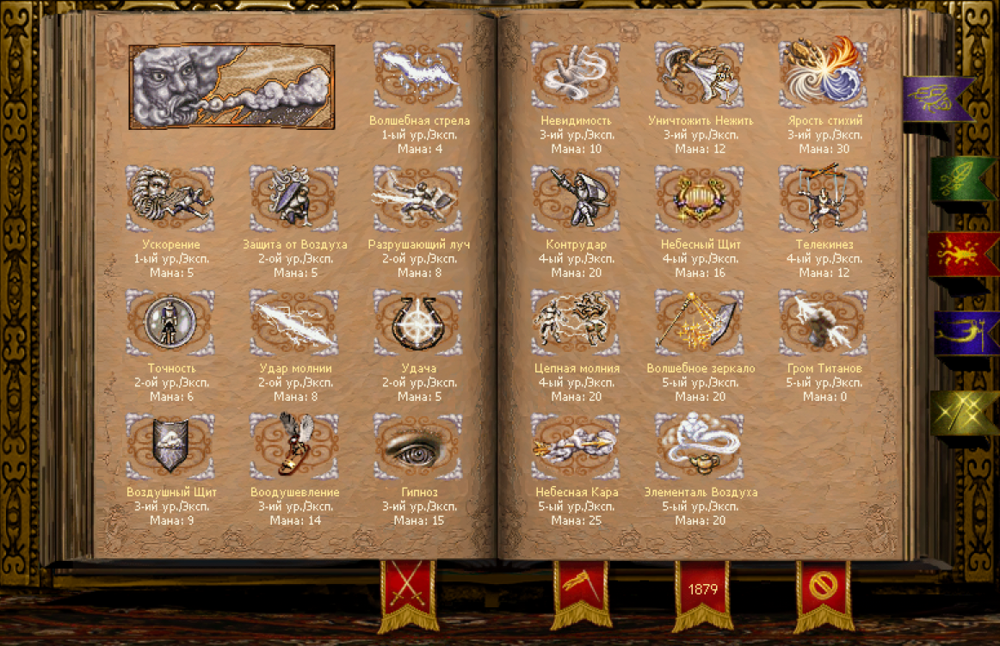
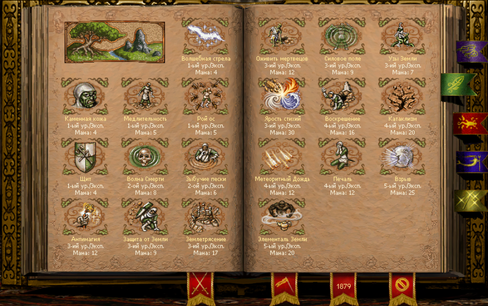
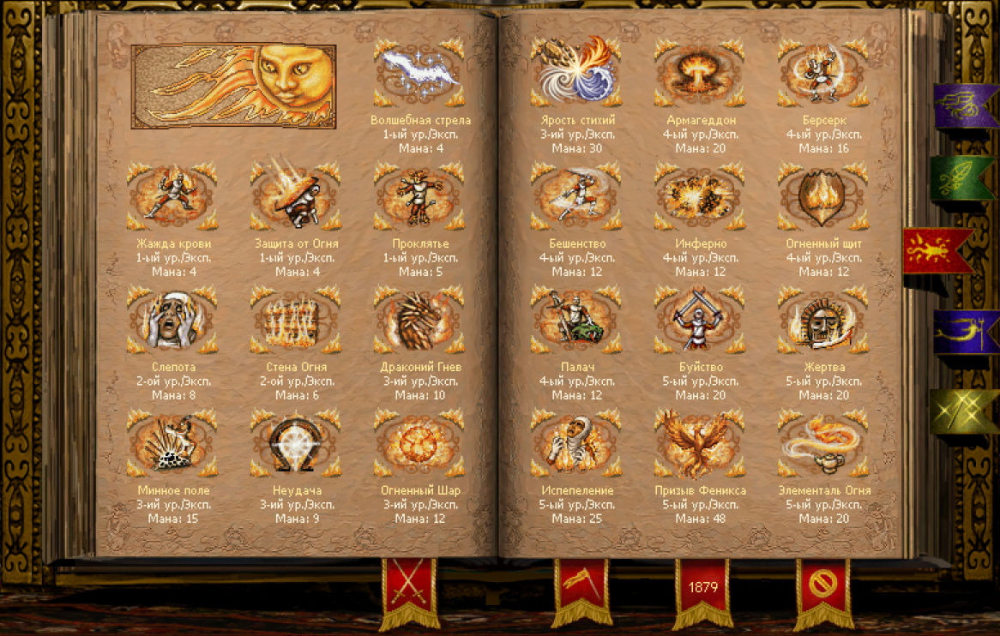
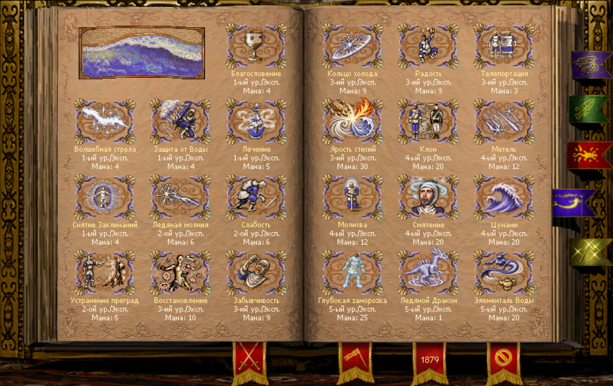
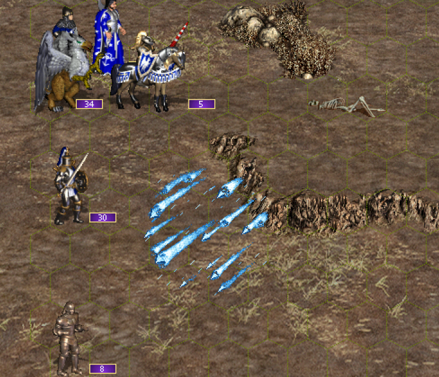

[Русский](README.ru.md) · [Download](https://github.com/toxeanubis1994-arch/ERA-Spells/releases/latest)

# ERA Spells

Toxeos combat magic for Heroes of Might and Magic III ERA: area and delayed damage, stack control, protective effects and summons. This is a standalone mod; the story Toxeos mod is not required.

## Spells

- **Blizzard** — Damages the target and stacks on adjacent hexes, reducing Speed by 2. The slow lasts 2/4/6 rounds according to mastery; Speed cannot fall below 2.

- **Deep Freeze** — Damages and freezes a stack, preventing it from acting or retaliating. The first damaging hit breaks the ice. Physical damage is amplified; Fire damage is increased and damage from other schools is reduced.

- **Heavenly Wrath** — Strikes a selected stack with a powerful discharge. A surviving target that has not acted loses its turn in the current round.

- **Cataclysm** — Damages ground creatures in both armies, leaving flying creatures unharmed. It can also make stacks that have not acted lose their current turn.

- **Dragon Wrath** — Increases a friendly stack's Defense and makes it a preferred target for enemy AI.

- **Inspiration** — Brings a friendly stack's next activation forward. Eligible creature levels depend on magic-school mastery.

- **Heavenly Shield** — Protects against physical damage, but not magical damage. It ends after its duration or hit limit is reached; limits depend on mastery.

- **Rampage** — Doubles a friendly stack's direct damage for two activations. Retaliation is also amplified and does not consume an activation of the effect.

- **Summon Phoenix** — Summons one Phoenix whose stats scale with hero level, Spell Power and Fire Magic. It flies, attacks three targets without retaliation and has Fire Shield. On death or replacement it releases Inferno. Recasting replaces the previous Phoenix.

- **Earth Bonds** — Creates an impassable barrier of roots. Attacks and spells can destroy it; durability and lifetime depend on mastery.

- **Incineration** — Deals half its damage immediately and the remainder at the start of the next three rounds. Recasting replaces the remaining effect.

- **Telekinesis** — Moves an enemy stack within 6 hexes, bypassing walls and obstacles. Eligible creature levels depend on mastery.

- **Confusion** — Prevents enemy retaliation. Expert mastery affects all eligible enemy stacks. Duration equals the hero's Spell Power.

- **Restoration** — Restores machines and golems.

- **Wasp Swarm** — Deals half its damage immediately and the other half at the start of the next round, then ends.

- **Tsunami** — Damages all enemy stacks without harming friendly troops.

- **Ice Dragon** — Summons a non-living, two-hex Ice Dragon protected against Water and Mind magic. Durability is measured in hits. Base cost: 25 mana. Available only through manual assignment, not random guilds or shrines.

- **Fury of the Elements** — Unleashes the power of all four elements against a selected enemy stack. A rare spell that is not granted by elemental books.

- **Invisibility** — Hides a friendly stack and lowers its targeting priority for enemy AI. Movement or an incoming or outgoing attack removes it; waiting and defending do not. Duration equals the hero's Spell Power.

## Acquisition and Map Editor

Assign spells to heroes, Mage Guilds, Shrines and other supported sources in ERA Map Editor; assignments are saved in the map. Ordinary custom spells can also appear randomly in guilds and shrines, less often than stock spells. Configure generation in `ToxData/spell_generation.tsv`. Fury of the Elements retains its separate rare chance. Phoenix does not generate in Rampart, Tower or Necropolis. Ice Dragon and Fury of the Elements are excluded from elemental books.

## Installation and language

Install the **ERA Spells** folder under `Mods` and enable it. Requires ERA/WoG and ERA Erm Framework. Amethyst and New Spells are not required. Do not enable simultaneously with the story Toxeos mod or another expansion replacing the same spell tables.

English is the default. Select `ru` in ERA settings for Russian, or set `Language=ru` under `[Era]` in `heroes3.ini`. Use `Language=en` for English. Restart the game and editor.

## Credits

Mod author: **Toxeos**.

Graphics assistance: **Dalion** and **Toriko**.

You are welcome to modify the mod and share your own versions.

## Screenshots

