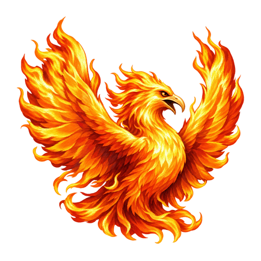

<p align="center"></p>

<h1 align="center">ERA Spells</h1>
<p align="center">Новые заклинания для Heroes of Might and Magic III ERA</p>

[English](README.md)

**[Скачать ERA Spells](../../releases/latest)** · [Сообщить об ошибке](../../issues)

**ERA Spells** — самостоятельная магическая часть Toxeos, ранее называвшаяся **Toxeos Native Spells**. Боевые эффекты работают через нативные ERA-плагины. В комплект входят ресурсы, интеграция с книгой магии и редактором карт. Сюжетный мод не требуется.

## Установка

1. Закройте игру и редактор.
2. Скопируйте целиком папку `ERA Spells` в папку `Mods` игры.
3. Включите **ERA Spells** в менеджере модов.
4. Запустите игру или ERA Map Editor заново.

Требуется ERA/WoG с ERA Erm Framework. New Spells и Amethyst не нужны. Не включайте одновременно сюжетный Toxeos, Toxeos Spells или другой плагин, заменяющий те же таблицы заклинаний.

## Язык

Английский используется по умолчанию. Для русского выберите `ru` в настройках ERA. Если переключателя нет, измените секцию файла `heroes3.ini` игры:

```ini
[Era]
Language=ru
```

Для английского укажите `Language=en`. Перезапустите игру и редактор. Пакет переводит собственные тексты, а не всю установленную игру.

## Редактор карт

Редакторный плагин находится в `EraEditor` и загружается для включённого мода. Новые заклинания назначаются через поддерживаемые окна героя, гильдии магов, шрайна и свитков. Назначения сохраняются существующим H3M transport без скрытого переноса через ERM.

Переименование мода не меняет Spell ID и данные карт. Карты других расширений могут использовать несовместимые ID; автоматическое преобразование не выполняется. Перед распространением карты сохраните и повторно откройте её для проверки назначений.

## Настройки

Вероятности случайной генерации задаются в `ToxData/spell_generation.tsv`. После редактирования перезапустите игру. Ручные назначения имеют приоритет.

- **Ледяной дракон:** только ручное назначение; исключён из случайных гильдий, шрайнов и книг стихий. Базовая стоимость — **25 маны**.
- **Ярость стихий:** отдельное редкое правило генерации; не выдаётся книгами стихий.
- **Призыв Феникса:** отдельное правило генерации с ограничениями по городам.

Эффекты, призывы и таймеры работают через DLL. Таланты, критические удары и академии сюжетного мода в самостоятельный пакет не добавляются.

## Совместимость

Призывы используют штатные слоты существ **122, 124 и 126**. Характеристики задаются программно, без Amethyst и замены общих creature TXT. Другие моды, занимающие эти слоты, могут конфликтовать.

Статические и консольные проверки выполнены для двух установок ERA, использованных при разработке. Это не доказательство совместимости с любой версией ERA или комбинацией плагинов. На своей установке проверьте сохранение карты, изучение, бой, save/load и BattleSave.

## Сообщения об ошибках

Создайте issue с версиями ERA/HD Mod, списком включённых модов, шагами воспроизведения и соответствующим crash/debug log. По возможности приложите минимальную тестовую карту. Перед публикацией удалите из логов личные пути и другую приватную информацию.

## Авторство

Мод происходит из Toxeos. Heroes III и оригинальные игровые ресурсы принадлежат соответствующим правообладателям. Эмблема с фениксом создана для ERA Spells. Общая лицензия на сторонние ресурсы этим репозиторием не предоставляется.
